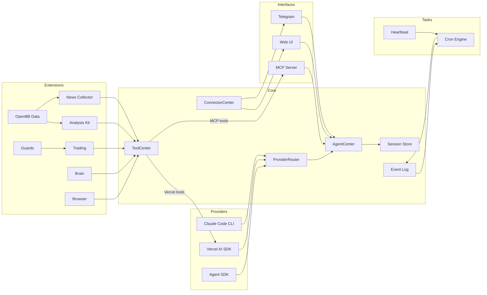

<p align="center">
  
</p>

<p align="center">
  <a href="https://deepwiki.com/TraderAlice/OpenAlice"></a> · <a href="https://traderalice.com"></a>
</p>

# Open Alice

Your one-person Wall Street. Alice is an AI trading agent that gives you your own research desk, quant team, trading floor, and risk management — all running on your laptop 24/7.

- **File-driven** — Markdown defines persona and tasks, JSON defines config, JSONL stores conversations. Both humans and AI control Alice by reading and modifying files. The same read/write primitives that power vibe coding transfer directly to vibe trading. No database, no containers, just files.
- **Reasoning-driven** — every trading decision is based on continuous reasoning and signal mixing.
- **OS-native** — Alice can interact with your operating system. Search the web through your browser, send messages via Telegram, and connect to local devices.

## Features

- **Multi-provider AI** — switch between Claude Code CLI, Vercel AI SDK, and Agent SDK at runtime, no restart needed
- **Unified trading** — multi-account architecture supporting CCXT (Bybit, OKX, Binance, etc.) and Alpaca (US equities) with a git-like workflow (stage, commit, push)
- **Guard pipeline** — extensible pre-execution safety checks (max position size, cooldown between trades, symbol whitelist)
- **Market data** — TypeScript-native OpenBB engine (`opentypebb`) with no external sidecar required. Covers equity, crypto, commodity, currency, and macro data with unified symbol search (`marketSearchForResearch`) and technical indicator calculator. Can also expose an embedded OpenBB-compatible HTTP API for external tools
- **Equity research** — company profiles, financial statements, ratios, analyst estimates, earnings calendar, insider trading, and market movers (top gainers, losers, most active)
- **News collector** — background RSS collection from configurable feeds with archive search tools (`globNews`/`grepNews`/`readNews`). Also captures OpenBB news API results via piggyback
- **Cognitive state** — persistent "brain" with frontal lobe memory, emotion tracking, and commit history
- **Event log** — persistent append-only JSONL event log with real-time subscriptions and crash recovery
- **Cron scheduling** — event-driven cron system with AI-powered job execution and automatic delivery to the last-interacted channel
- **Evolution mode** — two-tier permission system. Normal mode sandboxes the AI to `data/brain/`; evolution mode gives full project access including Bash, enabling the agent to modify its own source code
- **Hot-reload** — enable/disable connectors (Telegram, MCP Ask) and reconnect trading engines at runtime without restart
- **Web UI** — local chat interface with real-time SSE streaming, sub-channels with per-channel AI config, portfolio dashboard, and full config management (trading, data sources, connectors, AI provider, heartbeat, tools)

## Key Concepts

**Provider** — The AI backend that powers Alice. Claude Code (subprocess), Vercel AI SDK (in-process), or Agent SDK (`@anthropic-ai/claude-agent-sdk`). Switchable at runtime via `ai-provider.json`.

**Extension** — A self-contained tool package registered in ToolCenter. Each extension owns its tools, state, and persistence. Examples: trading, brain, analysis-kit.

**Trading** — A git-like workflow for trading operations. You stage orders, commit with a message, then push to execute. Every commit gets an 8-char hash. Full history is reviewable via `tradingLog` / `tradingShow`.

**Guard** — A pre-execution check that runs before every trading operation reaches the exchange. Guards enforce limits (max position size, cooldown between trades, symbol whitelist) and can be configured per-asset.

**Connector** — An external interface through which users interact with Alice. Built-in: Web UI, Telegram, MCP Ask. Connectors register with ConnectorCenter; delivery always goes to the channel of last interaction.

**Brain** — Alice's persistent cognitive state. The frontal lobe stores working memory across rounds; emotion tracking logs sentiment shifts with rationale. Both are versioned as commits.

**Heartbeat** — A periodic check-in where Alice reviews market conditions and decides whether to send you a message. Uses a structured protocol: `HEARTBEAT_OK` (nothing to report), `CHAT_YES` (has something to say), `CHAT_NO` (quiet).

**EventLog** — A persistent append-only JSONL event bus. Cron fires, heartbeat results, and errors all flow through here. Supports real-time subscriptions and crash recovery.

**Evolution Mode** — A permission escalation toggle. Off: Alice can only read/write `data/brain/`. On: full project access including Bash — Alice can modify her own source code.

## Architecture



**Providers** — interchangeable AI backends. Claude Code spawns `claude -p` as a subprocess; Vercel AI SDK runs a `ToolLoopAgent` in-process; Agent SDK uses `@anthropic-ai/claude-agent-sdk`. `ProviderRouter` reads `ai-provider.json` on each call to select the active backend at runtime.

**Core** — `AgentCenter` is the top-level orchestration center that routes all calls (both stateless and session-aware) through `ProviderRouter`. `ToolCenter` is a centralized tool registry — extensions register tools there, and it exports them in Vercel AI SDK and MCP formats. `EventLog` provides persistent append-only event storage (JSONL) with real-time subscriptions and crash recovery. `ConnectorCenter` tracks which channel the user last spoke through.

**Extensions** — domain-specific tool sets registered in `ToolCenter`. Each extension owns its tools, state, and persistence. `Guards` enforce pre-execution safety checks (position size limits, trade cooldowns, symbol whitelist) on all trading operations. `NewsCollector` runs background RSS fetches and piggybacks OpenBB news calls into a persistent archive searchable by the agent.

**Tasks** — scheduled background work. `CronEngine` manages jobs and fires `cron.fire` events into the EventLog on schedule; a listener picks them up, runs them through `AgentCenter`, and delivers replies via `ConnectorCenter`. `Heartbeat` is a periodic health-check that uses a structured response protocol (HEARTBEAT_OK / CHAT_NO / CHAT_YES).

**Interfaces** — external surfaces. Web UI for local chat (with SSE streaming and sub-channels), Telegram bot for mobile, MCP server for tool exposure. External agents can also [converse with Alice via a separate MCP endpoint](docs/mcp-ask-connector.md).

## Quick Start

Prerequisites: Node.js 22+, pnpm 10+, [Claude Code CLI](https://docs.anthropic.com/en/docs/claude-code) installed and authenticated.

```bash
git clone https://github.com/TraderAlice/OpenAlice.git
cd OpenAlice
pnpm install && pnpm build
pnpm dev
```

Open [localhost:3002](http://localhost:3002) and start chatting. No API keys or config needed — the default setup uses Claude Code as the AI backend with your existing login.

```bash
pnpm dev        # start backend (port 3002) with watch mode
pnpm dev:ui     # start frontend dev server (port 5173) with hot reload
pnpm build      # production build (backend + UI)
pnpm test       # run tests
```

> **Note:** Port 3002 serves the UI only after `pnpm build`. For frontend development, use `pnpm dev:ui` (port 5173) which proxies to the backend and provides hot reload.

## Configuration

All config lives in `data/config/` as JSON files with Zod validation. Missing files fall back to sensible defaults. You can edit these files directly or use the Web UI.

**AI Provider** — The default provider is Claude Code (`claude -p` subprocess). To use the [Vercel AI SDK](https://sdk.vercel.ai/docs) instead (Anthropic, OpenAI, Google, etc.), switch `ai-provider.json` to `vercel-ai-sdk` and add your API key to `api-keys.json`. A third option, Agent SDK (`@anthropic-ai/claude-agent-sdk`), is also available via `agent-sdk`.

**Trading** — Multi-account architecture. Crypto via [CCXT](https://docs.ccxt.com/) (Bybit, OKX, Binance, etc.) configured in `crypto.json`. US equities via [Alpaca](https://alpaca.markets/) configured in `securities.json`. Both use the same git-like trading workflow.

| File | Purpose |
|------|---------|
| `engine.json` | Trading pairs, tick interval, timeframe |
| `agent.json` | Max agent steps, evolution mode toggle, Claude Code tool permissions |
| `ai-provider.json` | Active AI provider (`claude-code`, `vercel-ai-sdk`, or `agent-sdk`), switchable at runtime |
| `api-keys.json` | AI provider API keys (Anthropic, OpenAI, Google) — only needed for Vercel AI SDK mode |
| `platforms.json` | Trading platform definitions (CCXT exchanges, Alpaca) |
| `accounts.json` | Trading account credentials and guard config, references platforms |
| `crypto.json` | CCXT exchange config + API keys, allowed symbols, guards |
| `securities.json` | Alpaca broker config + API keys, allowed symbols, guards |
| `connectors.json` | Web/MCP server ports, MCP Ask enable |
| `telegram.json` | Telegram bot credentials + enable |
| `web-subchannels.json` | Web UI sub-channel definitions with per-channel AI provider overrides |
| `tools.json` | Tool enable/disable configuration |
| `openbb.json` | Data backend (`sdk` / `openbb`), per-asset-class providers, provider API keys, embedded HTTP server config |
| `news-collector.json` | RSS feeds, fetch interval, retention period, OpenBB piggyback toggle |
| `compaction.json` | Context window limits, auto-compaction thresholds |
| `heartbeat.json` | Heartbeat enable/disable, interval, active hours |

Persona and heartbeat prompts use a **default + user override** pattern:

| Default (git-tracked) | User override (gitignored) |
|------------------------|---------------------------|
| `data/default/persona.default.md` | `data/brain/persona.md` |
| `data/default/heartbeat.default.md` | `data/brain/heartbeat.md` |

On first run, defaults are auto-copied to the user override path. Edit the user files to customize without touching version control.

## Project Structure

```
src/
  main.ts                    # Composition root — wires everything together
  core/
    agent-center.ts          # Top-level AI orchestration center, owns ProviderRouter
    ai-provider.ts           # AIProvider interface + ProviderRouter (runtime switching)
    tool-center.ts           # Centralized tool registry (Vercel + MCP export)
    ai-config.ts             # Runtime provider config read/write
    model-factory.ts         # Model instance factory for Vercel AI SDK
    session.ts               # JSONL session store + format converters
    compaction.ts            # Auto-summarize long context windows
    config.ts                # Zod-validated config loader
    event-log.ts             # Persistent append-only event log (JSONL)
    connector-center.ts      # ConnectorCenter — push delivery + last-interacted tracking
    async-channel.ts         # AsyncChannel for streaming provider events to SSE
    provider-utils.ts        # Shared provider utilities (session conversion, tool bridging)
    media.ts                 # MediaAttachment extraction from tool outputs
    media-store.ts           # Media file persistence
    types.ts                 # Plugin, EngineContext interfaces
  ai-providers/
    claude-code/             # Claude Code CLI subprocess wrapper
    vercel-ai-sdk/           # Vercel AI SDK ToolLoopAgent wrapper
    agent-sdk/               # Agent SDK (@anthropic-ai/claude-agent-sdk) wrapper
  extension/
    analysis-kit/            # Indicator calculator and market data tools
    equity/                  # Equity fundamentals and data adapter
    market/                  # Unified symbol search across equity, crypto, currency
    news/                    # OpenBB news tools (world + company headlines)
    news-collector/          # RSS collector, piggyback wrapper, archive search tools
    trading/                 # Unified multi-account trading (CCXT + Alpaca), guard pipeline, git-like commit history
    thinking-kit/            # Reasoning and calculation tools
    brain/                   # Cognitive state (memory, emotion)
    browser/                 # Browser automation bridge (via OpenClaw)
  openbb/
    sdk/                     # In-process opentypebb SDK clients (equity, crypto, currency, news, economy, commodity)
    api-server.ts            # Embedded OpenBB-compatible HTTP server (optional, port 6901)
    equity/                  # Equity data layer + SymbolIndex (SEC/TMX local cache)
    crypto/                  # Crypto data layer
    currency/                # Currency/forex data layer
    commodity/               # Commodity data layer (EIA, spot prices)
    economy/                 # Macro economy data layer
    news/                    # News data layer
    credential-map.ts        # Maps config key names to OpenBB credential field names
  connectors/
    web/                     # Web UI chat (Hono, SSE streaming, sub-channels)
    telegram/                # Telegram bot (grammY, polling, commands)
    mcp-ask/                 # MCP Ask connector (external agent conversation)
  task/
    cron/                    # Cron scheduling (engine, listener, AI tools)
    heartbeat/               # Periodic heartbeat with structured response protocol
  plugins/
    mcp.ts                   # MCP server for tool exposure
  skills/                    # Agent skill definitions
  openclaw/                  # Browser automation subsystem (frozen)
data/
  config/                    # JSON configuration files
  default/                   # Factory defaults (persona, heartbeat prompts)
  sessions/                  # JSONL conversation histories
  brain/                     # Agent memory and emotion logs
  cache/                     # API response caches
  trading/                   # Trading commit history (per-account)
  news-collector/            # Persistent news archive (JSONL)
  cron/                      # Cron job definitions (jobs.json)
  event-log/                 # Persistent event log (events.jsonl)
docs/                        # Architecture documentation
```

## Star History

[](https://star-history.com/#TraderAlice/OpenAlice&Date)

## License

[AGPL-3.0](LICENSE)
